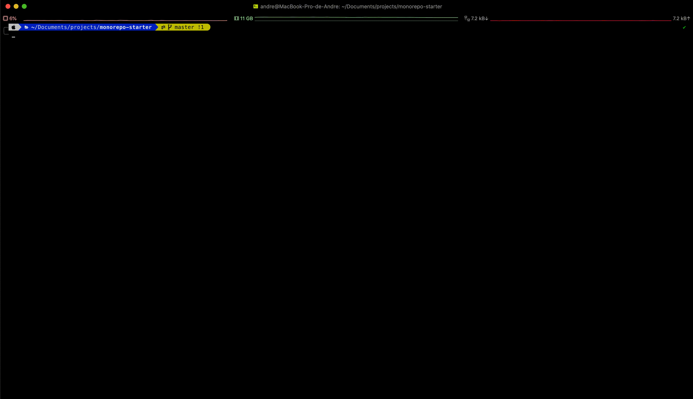

# trunkity

JS Monorepo CLI utils.
The primary intention of this CLI is to detect what will you changes affects inside your monorepo.



# Get Started
with yarn 
```bash
$ yarn add -g trunkity

# show affecteds
$ trunkity -a # --affected 
```

with npm 
```bash
$ npm i -g trunkity

# show affecteds
$ trunkity -a # --affected 
```

It can also be used as a dev dependencie.

# Mentions

This project was inspired by the [Nx](https://github.com/nrwl/nx) cli !